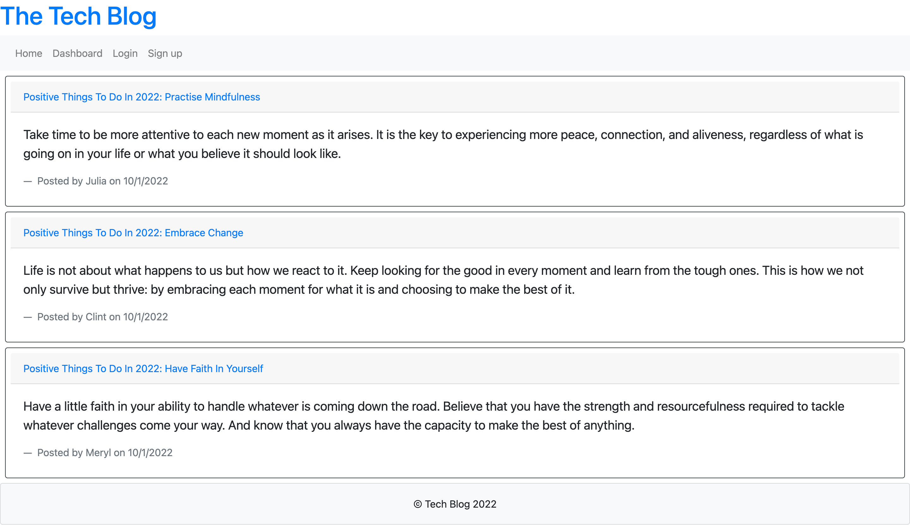
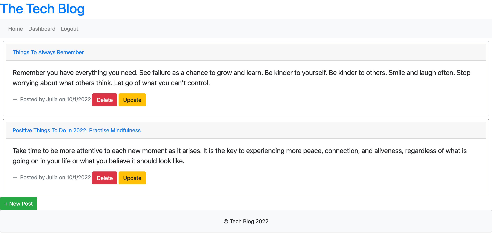

# tech-blog

 

CMS-style blog site similar to a Wordpress site, where developers can publish their blog posts as well as comment on other developers’ posts. The app's folder structure follows the Model-View-Controller paradigm.

**[Link to deployed app](https://aqueous-tundra-23493.herokuapp.com/)**
 
 

## Table of Contents

- [User Story](#user-story)
- [Motivation](#motivation)
- [Acceptance Criteria](#acceptance-criteria)
- [Mockup](#mockup)
- [License](#license)
   
   

## User Story

As a developer who writes about tech I want a CMS-style blog site so that I can publish articles, blog posts, and my thoughts and opinions
 
 

## Motivation

The purpose of this app is to practice working with express-handlebars (to implement Handlebars.js for Views), express-sessions (stores the session data on the client in a cookie) and connect-session-sequelize packages to add authentication, Express.js API creation, mySQL, the bcrypt package to hash passwords, Sequelize, npm, Insomnia, and more.
 
 

## Acceptance Criteria

WHEN I visit the site for the first time, I am presented with the homepage, which includes existing blog posts if any have been posted; navigation links for the homepage and the dashboard; and the option to log in.

WHEN I click on the homepage option, I am taken to the homepage.

WHEN I click on any other links in the navigation, I am prompted to either sign up or sign in.

WHEN I choose to sign up, I am prompted to create a username and password.

WHEN I click on the sign-up button, my user credentials are saved and I am logged into the site.

WHEN I revisit the site at a later time and choose to sign in, I am prompted to enter my username and password.

WHEN I am signed in to the site, I see navigation links for the homepage, the dashboard, and the option to log out.

WHEN I click on the homepage option in the navigation, I am taken to the homepage and presented with existing blog posts that include the post title and the date created.

WHEN I click on an existing blog post, I am presented with the post title, contents, post creator’s username, and date created for that post and have the option to leave a comment.

WHEN I enter a comment and click on the submit button while signed in, the comment is saved and the post is updated to display the comment, the comment creator’s username, and the date created.

WHEN I click on the dashboard option in the navigation, I am taken to the dashboard and presented with any blog posts I have already created and the option to add a new blog post.

WHEN I click on the button to add a new blog post, I am prompted to enter both a title and contents for my blog post.

WHEN I click on the button to create a new blog post, the title and contents of my post are saved and I am taken back to an updated dashboard with my new blog post.

WHEN I click on one of my existing posts in the dashboard, I am able to delete or update my post and taken back to an updated dashboard.

WHEN I click on the logout option in the navigation, I am signed out of the site.

WHEN I am idle on the site for more than a set time, I am able to view comments but I am prompted to log in again before I can add, update, or delete comments.
 
 

## Mockup

Homepage

Dashboard

 
 

## License

This application uses the MIT license.
